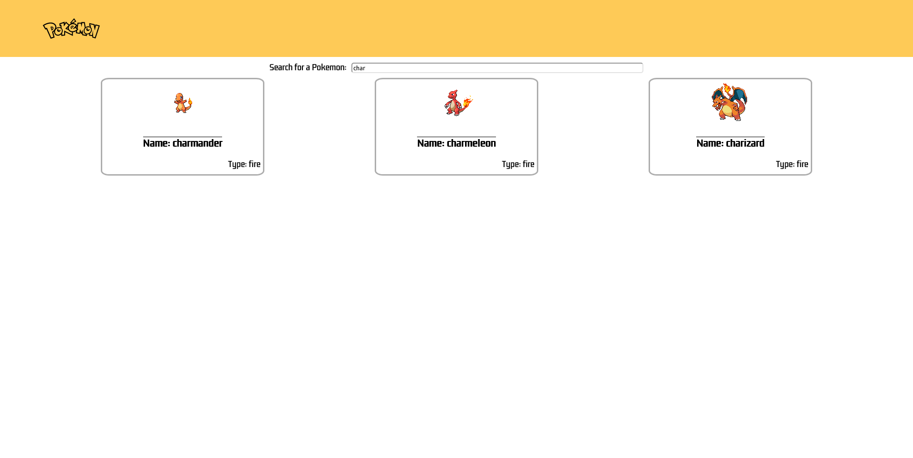
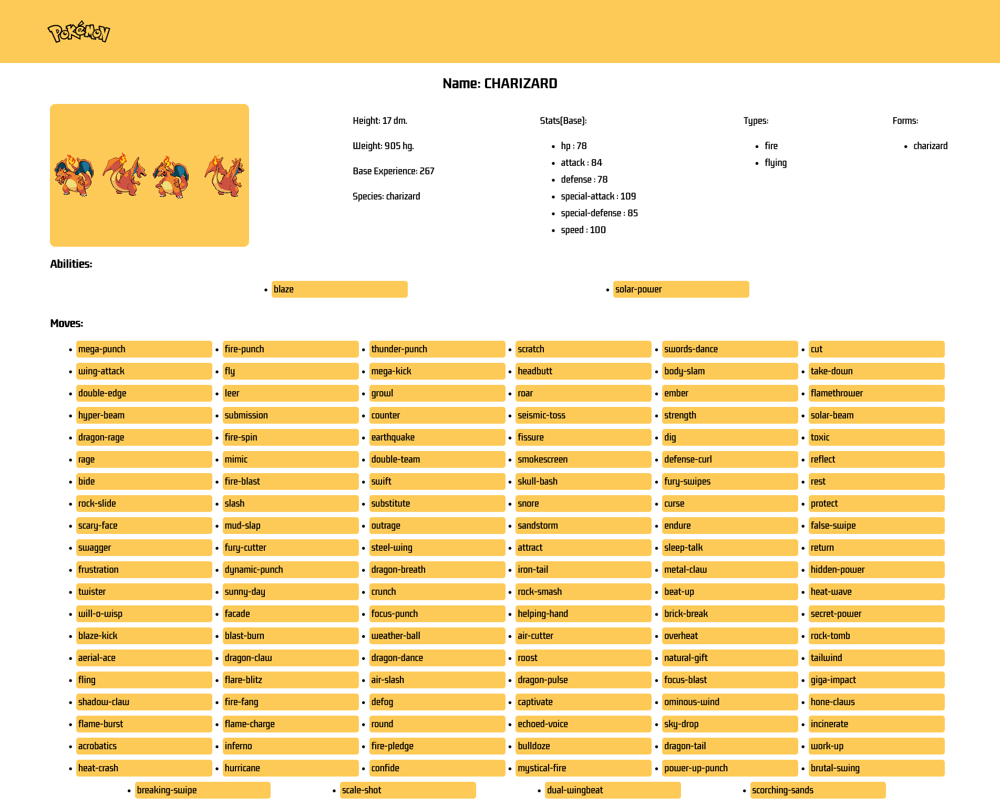

## 🚀 About the Project
Page made in React consuming poke-api with Axios, with the functionality to search among the 150 original pokemon and see their information.

## Screenshots

*Main Screen*

*Search Screen*

*Detail Screen*

## Demo

## 🔗 Links
